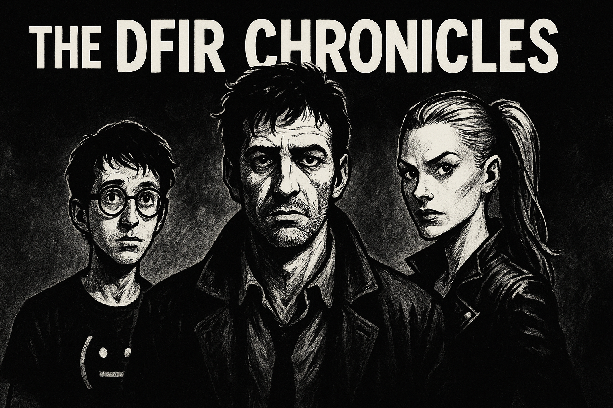

# DFIR-Chronicles

A cyber-noir saga from the shadows of the digital battlefield.

In a world ruled by ones and zeroes, where every login could be a lie and every email a loaded gun, The DFIR Chronicles follows a seasoned team of digital sleuths as they battle threats no firewall can stop alone.

- **Dylan Log**: the world-weary cyber-investigator haunted by past breaches.
- **Cyra Neuron**: the razor-sharp analyst with ice in her veins and logic in her blood.
- **Byte ("Bitty")**: the eccentric young forensicator who sees patterns where others see noise.

Together, they dissect malware masquerading as invoices, trace phishing trails through corporate carnage, and pull truth from tangled lines of JavaScript and shellcode. Each issue dives into real-world attack techniques, from HTML smuggling and credential harvesting to fileless intrusions and living-off-the-land exploits, retold through the lens of digital noir, where the glow of a terminal replaces the flicker of a cigarette, and the only thing sharper than a knife is a well-written grep.

Dark. Technical. Uncompromising.

The DFIR Chronicles isn't just a comic — it's incident response, with trench coats.
