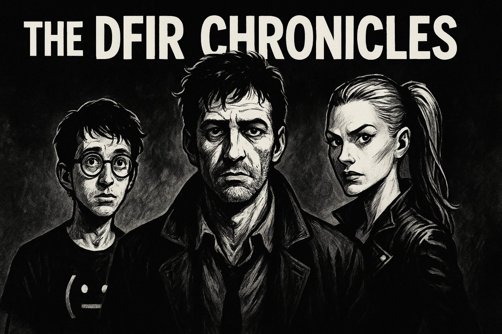

In a world ruled by ones and zeroes, where every login could be a lie and every email a loaded gun, a team of digital sleuths dissects the intrusions no firewall stopped. Each case is a real attack technique, retold in ink.

**[Read the case files online](https://ablescia.github.io/DFIR-Chronicles/)**

| | |
|---|---|
| **Dylan Log** | World-weary. Haunted by every breach that got through before the alert did. |
| **Cyra Neuron** | Ice in the veins, logic in the blood, a memory dump on the second screen. |
| **Byte** | Finds the pattern in the noise. Answers to "Bitty". |
| **Alexander** | Signs the incident reports and asks the questions nobody wants. |

---

## Episodes

### 01 — The HTML Smuggling Phishing Attack

An innocent-looking HTML attachment builds its own payload in the browser, and walks straight past the email gateway.

[Read the case file](https://ablescia.github.io/DFIR-Chronicles/episode.html?id=the-html-smuggling-phishing-attack) · [Download the comic (PDF)](./assets/pdf/DFIR_Chronicles_The_HTML_Smuggling_Phishing_Attack.pdf)

2025-08-05 · 15 pages

### 02 — The Bind Mounted Nightmare

The process is beaconing. The process has no PID. Something in /proc is lying, and the lie is mounted on top of the truth.

[Read the case file](https://ablescia.github.io/DFIR-Chronicles/episode.html?id=the-bind-mounted-nightmare) · [Download the comic (PDF)](./assets/pdf/DFIR_Chronicles_The_Bind_Mounted_Nightmare.pdf)

2025-09-03 · 15 pages · T1564.013

### 03 — The Unsanitized Upload

A forgotten upload endpoint with a JavaScript-only guard. Four minutes from first contact to a reverse shell on the other side of the world.

[Read the case file](https://ablescia.github.io/DFIR-Chronicles/episode.html?id=the-unsanitized-upload) · [Download the comic (PDF)](./assets/pdf/DFIR_Chronicles_The_Unsanitized_Upload.pdf)

2026-05-25 · 15 pages · T1505.003

### 04 — Four Bytes to Root

Four bytes written into the page cache hand back root. The binary on disk never changes. Only the process tree knows.

[Read the case file](https://ablescia.github.io/DFIR-Chronicles/episode.html?id=four-bytes-to-root) · [Download the comic (PDF)](./assets/pdf/DFIR_Chronicles_Four_Bytes_to_Root.pdf)

2026-06-04 · 15 pages · T1068, T1078.003, T1059.006

---

This repository holds the published comics and the site that presents them.
The scripts, page art, agent prompts and forensic artifacts behind each
episode are produced in a separate studio repository.

The comics are released under the licence in [LICENSE](./LICENSE); the
technical notes are free to reuse.
